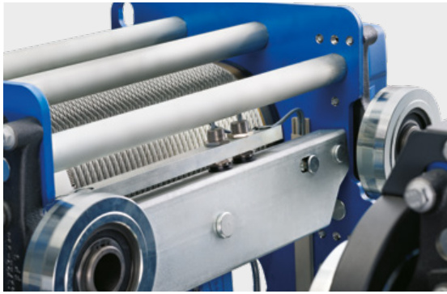
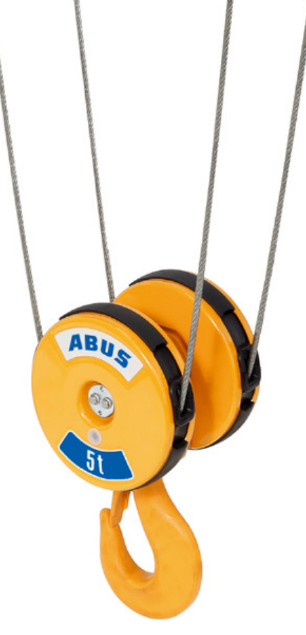
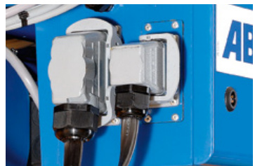
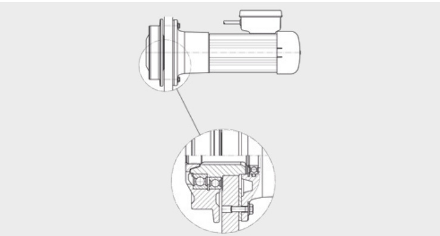

  

# QUALITÄT ZU IHRER VERFÜGUNG  

  

# ABUS Elektro-Seilzüge GM  

Absolute Verfügbarkeit ist die wichtigste Eigenschaft eines Seilzuges. Um dies auch im harten Praxisalltag zu gewährleisten, legen wir bei der Fertigung unserer Kransysteme einen außergewöhnlich hohen Qualitätsstandard an. ABUS Elektro-Seilzüge GM werden nach modernsten Fertigungsmethoden produziert und beweisen auch noch nach Jahren ihre herausragende Zuverlässigkeit, Sicherheit und Langlebigkeit. Vom Motor bis zum Seil, vom Getriebe bis zur Bremse, von der Elektrik bis zur Elektronik. Zum hohen Qualitätsniveau kommt die Flexibilität: ABUS Elektro-Seilzüge GM decken ein breites Tragfähigkeitsspektrum von $1000\,{\mathsf{k g}}$ bis 120 t ab. Durch den großen serienmäßigen Lieferumfang bieten Ihnen die ABUS Elektro-Seilzüge von Anfang an eine hochwertige Grundausstattung. Für spezielle Einsatzfälle stehen Ihnen zusätzliche Systemkomponenten zur Verfügung. Mit einem ABUS Elektro-Seilzug GM entscheiden Sie sich für ein Spitzenprodukt der Fördertechnik.  

  
Zweischienenlaufkatzen der Bauart D auf Zweiträger­lauf­ kranen.  

# WIR LIEFERN DIE LÖSUNG  

  
Einschienenlaufkatze der Bauart E an einem Säulen­ schwenkkran VS  

  
Einschienenlaufkatzen der Bauart E an Einträgerlaufkranen ELV  

  
Einschienenlaufkatze der Bauart E an einem Deckenlaufkran EDL  

# ABUS SEILZUG MODULAR: TECHNISCHE INTELLIGENZ IN TOPFORM  

# MODERNES, FUNKTIONALES ERSCHEINUNGSBILD, UND HOCHWERTIGES FARBKONZEPT.  

  

Der modulare ABUS Seilzug deckt den Tragfähigkeitsbereich bis 5 t ab, zweisträngig 1 t – 2,5 t und viersträngig 2 t – 5 t.  

Angetrieben wird der modulare Seilzug durch einen mit Frequenzumrichter betriebenen Katzfahrmotor. Der Hubantrieb hat einen vierpoligen Hubmotor mit serienmäßiger Frequenz­um­richter­-Steuer­ung. Wahlweise kann die Hub­geschwindig­keit stufenlos gesteuert oder polschaltbar simuliert werden. Die maximale Hubgeschwindigkeit ist lastabhängig und erreicht im Leerbetrieb das Doppelte der Nennhubgeschwindigkeit. Ein patentiertes induktives Messverfahren gewährleistet die Lastmessung auch bei Hubwerksstillstand.  

  

  

  

Die Einscherung des Seilzuges kann umgerüstet werden: von viersträngig (4/1) auf zweisträngig (2/1) und umgekehrt. Das ist ein Vorteil, wenn die Einsatzbedingungen sich ändern oder der Seilzug weiterverkauft werden soll. Die Umrüstung geht einfach und schnell, weil die Umlenkrollentraverse und die Festpunkttraverse durch eine zuverlässige Bolzenverbindung am Katzrahmen montiert sind und bei Bedarf einfach gewechselt werden können. Der ABUS Seilzug modular ist serienmäßig mit einstellbaren und dämpfend gelagerten Spurführungsrollen ausgestattet und schont daher den Untergurt des Kranes.  

  
Der komfortable Klappmechanismus macht die Montage des Seilzuges am Kran ganz einfach.  

  

  

Der Katzrahmen besteht aus verschraubten und verpressten Seitenwänden. Diese innovative und von ABUS patentierte Verbindungsart beeindruckt durch hohe Präzision und Festigkeit.  

  

Der Schaltschrank des Seilzuges ist konsequent modular aufgebaut: sämtliche Bauteile sind steckbar und können bei Bedarf am freien Markt aus der Produktion namhafter Her­steller nachgekauft werden – ein großer Service­vorteil!  

  

Der modulare Seilzug ist serienmäßig mit einem LED­-Matrix-­Display ausgestattet, das verschiedene Betriebsinformationen der Kransteuerung ABUControl und die Statusmeldungen von Krankomponenten anzeigt. Fehler können somit schnell und einfach erkannt und behoben werden. Das LED­Display stellt die Zeichen kon­trastreich dar und ist gut ablesbar.  

# ABUS ELEKTRO-SEILZÜGE GM: QUALITÄT IM DETAIL  

# 2 KATZFAHRGESCHWINDIGKEITEN UND VERZINKTES SEIL SERIENMÄSSIG  

  

# Hubgetriebe  

Schrägverzahnte, leise laufende Flachgetriebe in Leichtbauweise sorgen für das erforderliche Antriebsdrehmoment. Pro Modell stehen vier verschiedene Übersetzungsverhältnisse zur Verfügung.  

# Katzfahrantrieb  

Zwei kompakte Planetengetriebe mit pol­schaltbaren Bremsmotoren treiben zwei Laufräder direkt an.  

  

# Hubmotor  

  

Robuste, polschaltbare Zylinderläufermotoren mit integrierter Sicherheitsbremse bilden das starke Herz der ABUS Seilzüge.  

  

# Elektrik  

  

Die servicefreundliche Steuerung mit ABUS Steuereinheit LIS bietet Motorschutz, Betriebsstundenzähler und Lastbegrenzung.  

# Seilführung  

  

Eine gleitfähige, verschleißfeste Kunststoff-Seilführung, ausgebildet als flexibler Spreiz­ring, ermöglicht eine exakte Führung des Seiles. Gleichzeitig schont der Kunststoffring Seil und Seiltrommel. Die einfache Montage trägt besonders zur Wartungsfreundlichkeit des gesamten Aggregates bei.  

# Katzfahrwerk  

  

Das Katzfahrwerk besteht aus vier wälzgelagerten Spurkranzrädern mit Lebens­dauerschmierung, die für den Einsatz auf Laufbahnen mit parallelen Flanschen vorgesehen sind. Auf Anfrage sind die Räder auch für den Einsatz auf Laufbahnen mit geneigten Flanschen lieferbar.  

  

# Unterflasche  

# Sicherheitsbremse  

  

# Schnellsteckverbindung  

  

# ABUS Hubgrenzschalter  

  

Die formschönen Unterflaschen haben Eingriffschutz an den Seilaustrittsöffnungen. Verschleißfeste Seilrollen aus Vergü- tungsstahl mit mechanisch bearbeiteten Seilrillen und vergü- teten Lasthaken bieten hohe Sicherheit und lange Standzeiten.  

Die Elektromagnet-Zweischeibenbremse bietet eine Bremsautomatik bei Netzausfall. Asbestfreie Bremsbeläge mit Standzeiten von ca. 1 Mio. Schaltungen verlängern die Wartungsintervalle.  

Durch die bereits vorinstallierten ABUS Schnellsteckverbindungen werden Montage- und Wartungsarbeiten auf ein Minimum beschränkt. Mit wenigen Handgriffen lassen sich elektrische Verbindungen herstellen oder lösen. Ein weiteres Plus: Verwechslungen beim Anschließen sind unmöglich.  

Der ABUS Hubgrenzschalter stellt die präzise Einhaltung der höchsten bzw. tiefsten Hakenstellung sicher. Zwei serienmä- ßige Schaltpunkte in der höchsten Hakenstellung sorgen für doppelte Sicherheit. Bei Bedarf ist er zum Betriebsgrenzschalter erweiterbar (Option).  

# TECHNOLOGIE DER ABUS ELEKTRO-SEILZÜGE  

# Elektro-Seilzüge GM sind ein besonderer Beweis des ABUS Qualitätsniveaus.  

• Entwickelt mit Hilfe moderner Berechnungs- und CADProgramme  

• Richtungsweisende Technik: serienmäßig 2 Geschwindig­ keiten für Hub- und Katzfahrwerk, serienmäßige Motor­ schutzfunktion  

• Optimiert durch kontinuierliche Umsetzung der Erfahr­ungen aus Praxis und Testergebnissen  

• Produziert und geprüft auf modernen Fertigungs­ein­rich­ tungen in hoher, gleichbleibender Qualität unter Anwendung eines QM-Systems nach DIN EN ISO 9001  

• Ausgestattet mit CE-Zeichen für problemlosen Einsatz im europäischen Wirtschaftsraum, bieten wir sie als funktionssichere und langlebige Einheiten im Tragfähig­ keitsbereich von 1 t – 120 t an. 7 Grundmodelle sind in verschiedenen, auf den jeweiligen Einsatzfall abge­stimmten Bauarten, Geschwindigkeiten, Hubhöhen und Triebwerks­ 11 gruppen lieferbar. 7 6 5 4 3 2  

# Bauweise des Hubwerks  

Durch die parallele Anordnung von Seiltrommel und Hubmotor sowie den modularen Aufbau und die funktionsgerechte Anordnung aller Baugruppen ergibt sich eine kompakte, servicefreundliche Bauweise mit sehr günstigen Abmessungen, die den Wettbewerbsvergleich nicht scheut. Direkte formschlüssige Verbindungen zwischen Hubmotor, Hubgetriebe, Seiltrommel und Grenzschalter vermeiden Bauteile und erhöhen die Zuverlässigkeit. Modulare CHubantriebe erhöhen die Flexibilität bei der Typenauswahl Bund erleichtern einen evtl. Service-Einsatz.  

# Hubmotoren  

ABUS verwendet robuste, polschaltbare Zylinderläufermotoren in formschönem Alu-Strangpreßprofil mit integrierter Sicherheitsbremse und wartungsfreundlichem Stecker­ anschluß. Isolationsklasse F, Schutzart IP 55. Optimierte Statorblechschnitte bieten bessere elektrische Ausnutzung bei hoher Laufkultur und thermischer Reserve bei hoher Schalthäufigkeit. Das führt im Vergleich zu konventionellen Motoren zu kleineren Baugrößen. Maschinell hergestellte Wicklungen gewährleisten reproduzierbare Qualität.  

  

# Hubgetriebe  

Schrägverzahnte Präzisions-Flachgetriebe in Leichtmetallgehäusen mit einsatzgehärteten Verzahnungen, hochwertiger Oberflächenbehandlung und Lebensdauer- Ölschmierung sorgen für hohe Sicherheit und leisen Lauf bei einem Minimum an Wartungsaufwand.  

# Hubwerksbremsen  

  

Elektromagnet-Zweischeibenbremsen gewährleisten eine Bremsautomatik bei Netzausfall. Umweltfreundliche Bremsbeläge mit Standzeiten von ca. 1 Mio. Schaltungen sorgen für große Wartungsintervalle.  

# ABUS Drahtseile  

• erhöhte Seilbruchkraft   
• erhöhte Biegewechselfestigkeit   
• hohe Gefügefestigkeit   
• verbesserter Widerstand gegen Abrieb   
• erhöhter Korrosionsschutz  

  

# Seiltrieb  

Günstige Baumaße und Gewichte der Elektro-Seilzüge haben bei den ABUS Entwicklungsingenieuren hohe Priorität. Deshalb werden hochfeste, verzinkte Drahtseile mit verdichteten Litzen und speziellem Gefügeaufbau verwendet. Die Vorzüge dieser Seile führen in Verbindung mit verschleißfesten Seiltrommeln und Seilrollen zu kleineren Abmessungen des Seiltriebs ohne Einbußen an Sicherheit und Lebensdauer.  

# Bauweise der Tragwerke, Fahrwerke und Antriebe Elektrik  

Die Integration der Serienhubwerke in die für den jeweiligen Einsatzfall optimierten Tragwerke und deren Kombinationen mit unterschiedlichen Fahrwerken führt zu den auf den Seiten $10~-~14$ beschriebenen Katzbauarten. Sie zeichnen sich aus durch kompakte Bauweise, günstige Bauhöhen, günstige Anfahrmaße, Praxistauglichkeit und Qualität. Der Anschluß der Fahrwerksträger an die Tragwerke der Zweischienenlaufkatzen erfolgt über mechanisch bearbeitete Gelenkund Bolzenverbindungen. Dadurch werden geometrisch exakte Radstellungen mit Maschinenbaupräzision erreicht. Außerdem wird durch den gelenkigen Anschluß eines Fahrwerkträgers die ständige Auflage aller vier Räder und die statisch bestimmte Radlasteinleitung in die Kranbrücke garantiert. Das Fahrwerk ist mit wälzgelagerten Spurkranzrädern ausgerüstet, die durch Einzelantriebe zu nahezu wartungsfreien, direktangetriebenen Einheiten ergänzt werden. Polschaltbare Zylinderläufermotoren mit Sanftanlaufcharakteristik, Zusatzschwungmassen auf den Motorwellen und integrierte Scheibenbremsen sorgen im Netzbetrieb für günstiges, weitgehend lastunabhängiges Beschleunigen und Bremsen Elektronische Sanftanlaufgeräte und Frequenzumrichter bieten weitere Möglichkeiten zur Erhöhung der Fahrkultur.  

  

# Seiltrommeln  

Entwickelt und optimiert mit Hilfe von Finite-Elemente Berechnungsprogrammen  

  

  

ABUS Seilzugsteuerungen besitzen eine ausgereifte Technik und decken durch ihren modularen Aufbau einen großen Anwendungsbereich ab. Alle Bewegungsrichtungen sind für zweistufigen, polschaltbaren Betrieb ausgelegt. Der servicefreundliche, sicherungslose Aufbau der Steuerungen in Kanalverdrahtung garantiert durch den Einsatz von montagefreundlichen, schraubenlosen Klemmen sicheren Betrieb.  

# ABUS ELEKTRO-SEILZÜGE GM FÜR EINTRÄGERKRANE  

# Bauart E – Einschienenlaufkatze  

Einschienenlaufkatze in Kompaktbauweise mit sehr günstigen Baumaßen und mit zwei Direktantrieben für das Fahrwerk. Die Katzfahrwerke sind auf verschiedene Flanschbreiten voreingestellt. Preisgünstige Lösung, häufigste Bauart im Tragfähigkeitsbereich 1 t – 16 t.  

  

# Bauart U – Unterflanschlaufkatze  

Unterflanschlaufkatze für höhere Tragfähigkeiten und größere Hubhöhen. Katzfahrwerke mit vier Direktantrieben. Die Verteilung der Radlast auf 8 Laufräder erlaubt den Einsatz von handelsüblichen Walzprofilträgern bei Einschienenkatzbahnen. Krane mit kleinerer Spannweite können auch bei größerer Tragfähigkeit mit dieser Katzbauart als Einträgerversion realisiert werden. Tragfähigkeitsbereich $6.3\,\mathrm{t}-25\,\mathrm{t}.$ .  

  

  

  

  

# Bauart S – Seitenlaufkatze  

Seitenlaufkatze mit Seilablauf neben der Kranbrücke. Tragfähigkeitsbereich 1 t – 10 t. Durch die optimierte Hakenhöhe dieser Katzbauart und die Möglichkeit, Kranbrücken bis mehr als $35\,\mathsf{m}$ Spannweite in Einträgerbauart auszuführen, ergeben sich im Vergleich zu anderen Bauarten Vorteile bei der Gesamtinvestition.  

• Im Vergleich zum Einträgerkran mit Einschienenlaufkatze Bauart E kann die Hallenhöhe reduziert werden. • Im Vergleich zum Zweiträgerkran ergeben sich bei etwa gleichen Bauhöhen geringere Kranbahn- und GGebäudebelastungen.  

  

  
Stützrollen mit Drehgelenk  

  

# Bauhöhenvergleich bei Tragfähigkeit $10\,\mathfrak{t}\times25000\,\mathfrak{m m}$ Spannweite  

Einträgerkran mit Einschienenlaufkatze Bauart E  

Zweiträgerkran mit Zweischienenlaufkatze Bauart D  

Einträgerkran mit Seitenlaufkatze Bauart S  

  

# ABUS ELEKTRO-SEILZÜGE GM FÜR ZWEITRÄGERKRANE  

# Bauart D – Zweischienenlaufkatze normaler Bauart  

Kompakte Zweischienenlaufkatze für den mittleren Tragfähigkeitsbereich mit gelenkigem Fahrwerksträgeranschluß für garantierte Vierradauflage, mit zwei Direktantrieben für das Katzfahrwerk. Tragfähigkeitsbereich 1 t – 63 t.  

  
1) True vertical lift (ohne Haken­wanderung und ohne Haken­drehung)  

# Bauart DA – Zweischienenlaufkatze in abgesenkter Bauart  

Abweichend zu Bauart D wird hier der Tragholm mit Hubwerk zwischen den Fahrwerksträgern gelenkig angeschlossen. So wird eine minimale Katzbauhöhe erreicht – die Bauart bei geringem Freiraum nach oben als Variante zur ebenfalls abgesenkten Bauart DQA. Technische Daten und Maße hierzu nennen Ihnen gerne die ABUS Berater.  

# Bauart DQA – Zweischienenlaufkatze in quer abgesenkter Bauart  

Zweischienenlaufkatze, minimale Bauhöhe mit Seiltrommelachse in Katzfahrrichtung, mit gelenkigem Fahrwerksträger­ anschluß für garantierte Vierradauflage mit zwei Direktantrieben für das Katzfahrwerk. Tragfähigkeitsbereich 1 t – 40 t. Technische Daten und Maße hierzu nennen Ihnen gerne die ABUS Berater.  

  

  

  

# Bauart Z – Zweischienenlaufkatze mit Zwillingshubwerk  

Kompakte Zweischienenlaufkatze mit Zwillingshubwerk und gelenkigem Fahrwerksträgeranschluß für garantierte Vierradauflage, mit zwei Direktantrieben für das Katzfahrwerk. Tragfähigkeitsbereich 8 t – 120 t.  

  

# Bauart ZA – Zweischienenlaufkatze mit Zwillingshubwerk in abgesenkter Bauart  

Abweichend zu Bauart Z wird hier der Tragholm mit Hubwerk zwischen den Fahrwerksträgern gelenkig angeschlossen. So wird eine minimale Katzbauhöhe erreicht – die Bauart bei geringem Freiraum nach oben. Technische Daten und Maße hierzu nennen Ihnen gerne die ABUS Berater.  

  

# Katzfahrantriebe  

Laufrad-Durchmesser $\leqslant280\,\mathsf{m m}$ Planetengetriebemotoren  

  

Laufrad-Durchmesser $\geqslant350\,\mathsf{m m}$ Flachgetriebemotoren  

  

  

# ERLÄUTERUNG DER TYPENBEZEICHNUNG  

  
Bisherige Bezeichnung: GM 820 L6-204.41.06.3.E  

# SEILEINSCHERUNG DER ABUS ELEKTRO-SEILZÜGE  

  

# EIN WICHTIGES THEMA: DIE TRIEBWERKSGRUPPENERMITTLUNG  

Neben der Bauart, der Tragfähigkeit, dem Hakenweg und der Hubgeschwindigkeit ist die auf den bestimmungsgemä- ßen Gebrauch abgestimmte Triebwerksgruppe ein wichtiges Kriterium bei der Auswahl eines Hubwerkes. Serienhebezeuge sind im Regelfall – bei Verwendung gemäß FEM 9.511 – für eine mittlere theoretische Lebensdauer von 10 Jahren konzipiert. Eine nicht den tatsächlichen Einsatzbedingungen entsprechende Auswahl führt u. U. dazu, dass die tatsächliche Lebensdauer weit unter dem Wert von 10 Jahren liegen kann. Dies hat dann unverhältnismäßig hohe Zusatzkosten durch Wartung, Reparatur und vorzeitige Generalüberholung zur Folge. Der Betreiber ist nach DGUV Vorschrift 54 und 52 gefordert, bei der wiederkehrenden Prüfung den verbrauchten Anteil der theoretischen Nutzungsdauer zu ermitteln. Mit Ablauf der theoretischen Nutzungsdauer ist das Hebezeug außer Betrieb zu nehmen. Ein Weiterbetrieb ist zulässig, wenn durch einen Sachverständigen festgestellt worden ist, dass einem Weiterbetrieb keine Bedenken entgegenstehen und die Bedingungen für den Weiterbetrieb festgelegt worden sind. In der Regel wird eine Generalüberholung des Hubwerkes angeordnet werden. Somit ist sichergestellt, dass das Hebezeug nur innerhalb einer sicheren Betriebsperiode (S.W.P. – Safe Working Period) betrieben wird.  

Zur Ermittlung der Triebwerksgruppe ist neben der mittleren Laufzeit $\mathfrak{t}_{\mathfrak{m}}$ (kumulierte Arbeitszeit des Hubwerks pro Tag) die richtige Einschätzung bzw. Ermittlung des Lastkollektivs k erforderlich. Die Ermittlung erfolgt nach folgender Formel:  

t=2 x mittlere Hubhöhe (m) x Spiel (1/h) x Arbeitszeit (h/Tag) m60(min/h) x Hubgeschwindigkeit (m/min)  

# mittlere Hubhöhe:  

durchschnittlich durchfahrener Hubweg  

# Spiele:  

durchschnittliche Anzahl an Hubvorgängen pro Stunde (1 Spiel besteht aus einmaligem Anheben und Absetzen einer Last, d. h. 2 x durchfahrener Hubweg) (ablaufbedingte Leerhübe sind zu addieren, wirken sich jedoch reduzierend auf das im folgenden anzunehmende Lastkollektiv aus)  

# Arbeitszeit:  

geleistete Arbeitszeit pro Tag, innerhalb der die o. g. durchschnittlichen Spiele pro Stunde geleistet werden.  

Der folgenden Tabelle ist die theoretische Nutzungsdauer D in Stunden für die Triebwerksgruppen 1Bm, 1Am, 2m, 3m und 4m zu entnehmen.  

# Hubgeschwindigkeit:  

durchschnittliche Hubgeschwindigkeit, in der Regel die max.   
Hubgeschwindigkeit, mit der die Spiele abgearbeitet werden.  

Die Einstufung eines Hebezeuges in die nächsthöhere FEMGruppe bedeutet demnach bei gleichen Einsatzbedingungen eine Verdoppelung der theoretischen Lebensdauer. Zu diesem komplexen Thema gibt die FEM 9.755 sowie der 4. Nachtrag zur DGUV Vorschrift 54 Winden, Hub- und Zuggeräte und deren Durchführungsanweisung genauere Auskünfte.  

  

Mit Hilfe der nachstehenden Tabelle wird in Kenntnis der mittleren Laufzeit $\mathfrak{t}_{\mathfrak{m}}$ und des Lastkollektivs die richtige Triebwerksgruppe nach DIN 15020 bzw. FEM 9.511 gewählt.  

  

# ZUSATZAUSRÜSTUNGEN  

# ABUS Steuereinheit LIS – das intelligente Herzstück der ABUS Seilzüge  

ABUS Seilzüge sind mit einer intelli­genten Hubwerkssteuerung LIS ausgestattet. Sie ist in zwei Varianten LIS-SE oder LIS-SV verfügbar. Beide beinhalten eine Überlast­sicherung, die das Hubwerk sicher vor Überlastung schützt. Während bei der LIS-SV die Lasterfassung durch einen DehnungsmeßstreifenSignalgeber erfolgt, wird bei der LIS-SE bei laufendem Motor eine dreiphasige Strom- und Spannungsmessung vorgenommen. Aus diesen beiden Größen berechnet LIS-SE die aktuelle Hakenlast. Zur Visualisierung der ausgewerteten Hakenlast kann optional an beiden Geräten eine Lastanzeige angeschlossen werden.  

Zur Ermittlung der verbrauchten Nutzungsdauer sind alle LIS-Steuereinheiten serienmäßig mit einem Betriebsstundenzähler ausgestattet. Für eine exakte Ermittlung der verbrauchten Nutzungsdauer kann LIS optional mit einem Lastkollektivspeicher nach FEM 9.755 ausgeliefert werden. Dadurch werden über die gesamte Nutzungsdauer des Hubwerks sichere Betriebszeiten gewährleistet. Der Betreiber kann die Werte des Lastkollektivspeichers ohne großen Aufwand am Gerät selbst ablesen. Zusätzlich zu den genannten Merkmalen werden noch eine Reihe weiterer Funktionen durch die LIS-Steuereinheiten realisiert, die zu einem sicheren und wartungsarmen Betrieb aller ABUS Seilzüge führen. Durch die Kombination von elektrischen und elektronischen Stromkreisen in redundanter Anordnung erfüllen die Geräte die hohen Anforderungen an Sicherheit und werden dem Anspruch der geltenden Normen nach Diversität und Redundanz gerecht.  

Vor thermischer Überlastung der Hubmotoren schützen zuverlässig, bei bestimmungsgemäßem Gebrauch, die integrierten Funktionen Motorüberstromschutz sowie der geführte Anlauf. Der Motorüberstromschutz schaltet bei einem permanent zu hohen Motorstrom das Hubwerk aus. Der geführte Anlauf sorgt dafür, dass ein unzulässig hoher Tippbetrieb in der schnellen Geschwindigkeitsstufe vermieden wird. Eine weitere integrierte Funktion mit hohem Anwendernutzen ist das generatorische Bremsen. Bei jedem Bremsvorgang aus der schnellen Geschwindigkeit wird die Motordrehzahl durch kurzzeitiges generatorisches Bremsen vermindert, bevor die mechanische Bremse einfällt. Dadurch wird die Standzeit des Bremsbelages deutlich erhöht.  

# Der ABULiner  

ermöglicht eine komfortable Lösung für alle Einsatzfälle, bei denen Hubwerke mit variabler Hubgeschwindigkeit für besonders exaktes Positionieren ausgestattet werden sollen. Mit diesem Frequenzumrichter kann außerdem die maximale Hubgeschwindigkeit bei reduzierter Last über die Nennhubgeschwindigkeit hinaus erhöht werden. Ebenfalls möglich ist der Einsatz des ABULiners beim Kran- und Katzfahren.  

# Pendelreduzierte Bewegungsabläufe bei zweistufigem Betrieb  

Wer empfindliche Güter oder große Lasten optimal transportieren will, für den erweitert ABUS sein polschaltbares System um das Sanftanlaufgerät AZS und das Sanftumschaltrelais SU-2. Mit diesen elektronischen Baugruppen kann der Kranbediener das am Gerät einstellbare Beschleunigungsverhalten sowie die verbesserten Verzögerungseigenschaften zur sanften Steuerung der Kran- und Katzfahrt als Alternative zum Frequenzumrichter nutzen.  

# Geeichte Wägeunterflasche  

  

  
Weitere mögliche Optionen sind auf unserer Website zu finden. Oder sprechen Sie uns einfach an.  

  

Zu wissen, was am Haken hängt, das ist für viele Kranbetreiber wichtig: Waren abwiegen und an Kunden berechnen, LKWs beladen, Produktionsanlagen mit abgewogenem Material beschicken, Sicherheitsvorschriften für Lasten einhalten oder das Gewicht von Containern ermitteln – häufig ist die ABUS Wägeunterflasche die wirtschaftlich vorteilhafte Lösung. Sie ist eine digitale Handelswaage der Genauigkeitsklasse III mit EG-Zulassung der Physikalisch Technischen Bundesanstalt. Die Kranwaage wird geeicht und betriebsfertig geliefert. Die Wäge-Elektronik besteht aus moderner SMD Technologie in robuster Industrieausführung. Das Wägemodul integriert sich optimal in die Unterflasche von ABUS Seilzügen.  

  

Abgesenkte Katzbauarten ermöglichen den Einsatz von Zweiträgerlaufkranen bei geringem Freiraum oberhalb der Kranbahn. Auch die höher positionierte Kranbrücke bei Wahl einer abgesenkten Katze kann den entscheidenden Vorteil bringen – beispielsweise beim Transport sperriger Maschinen oder großvolumiger Behälter.  

  

Optionaler Zweikatzbetrieb für den Transport von besonders schweren und sperrigen Lasten. Die Steuerung der Seilzüge erfolgt von der Kransteuerung aus wahlweise einzeln oder gemeinsam. Ein echter Zugewinn an Sicherheit für Ihre Transportaufgabe.  

  

# ABUCONTROL: HEBT KRANE AUF EIN NEUES LEVEL  

  

  

#  

ABUS Krane mit ABUControl-Steuerung können über Fahrprofile auf Ihre Gegebenheiten angepasst werden. Krane mit zwei festen Geschwindigkeiten fahren z.B. völlig anders als frequenzumrichtergesteuerte Krane. Fahr- und Hubprofile ermöglichen die Anpassung der Krane an Ihre aktuelle bzw. gewünschte Situation. Damit entfällt bei vorhandenen Kranen der Umstellungsaufwand Ihrer Kranfahrer und sie spüren eher die gestiegene Produktivität durch die zusätzliche Krananlage.  

#  

Die ABUS Pendeldämpfung erhöht die Sicherheit und den Komfort beim Transport von Gütern in sensiblen Bereichen. Die Pendeldämpfung basiert auf mathematischen Berechnungen. Dabei werden die Fahrgeschwindigkeiten, Beschleunigung und Verzögerung von Kran und Katze, die Hakenposition und die Länge des Lastaufnahmemittels berücksichtigt. Auch Personen, die nur selten Krane bedienen, können mit Hilfe der Pendeldämpfung Lasten sicher transportieren.  

#  

Die ABUS Gleichlaufregelung von zwei Katzen an einem Kran ermöglicht sicheres Handling von langen Produkten. Ein Auseinanderlaufen der Hubgeschwindigkeiten wird durch ständige Regelung selbst bei unterschiedlichen Seilzügen wirkungsvoll unterbunden. Vorausgesetzt der Kran ist mit Frequenzumrichter Heben ausgerüstet. Auch bei Kranen, die im Tandem laufen, werden die Fahrgeschwindigkeiten geregelt. Zwei Krane, maximal vier Katzen und Hub, alles geregelt.  

  

  

Betriebsdaten, Einstellungen, Service-Informationen. Mittels der modernen Oberfläche KranOS behalten Sie den Kran im Auge. Kabellos von jedem Laptop oder Tablet mit Browser. Und die jährlich wiederkehrende Prüfung geht noch ein bisschen flotter.  

#  

  

ABUControl setzt auf bewährte, am freien Markt erhältliche Bauteile von namhaften Elektronikherstellern. Ein Austausch oder Reparatur bedingt weder „Herrschaftswissen“ noch „Softwarelizenzen“. Sie behalten zu jeder Zeit die vollständige Kontrolle über den Kran und die freie Wahl des Servicepartners. ABUControl - ein einzigartiges Versprechen für einfache Wartung und Reparatur.  

# ABUS QUALITÄTSSTANDARD: SORGFÄLTIGE UND MODERNE FERTIGUNGSMETHODEN  

Strahlanlage für Seilzug-Seitenschilder  

Mechanische Bearbeitung des Seilzug-Gehäuse auf 4-Achsen Fräszentren  

  

  

  

Die stahlbauliche Fertigung der Katzrahmen erfolgt mit Hilfe eines Schweißroboters. Dadurch sind kurze Durchlaufzeiten und gleichbleibende Schweißergebnisse gewährleistet.  

Korrosionsschutz und Oberflächenveredelung auf Basis von Wasserlacken  

  

Auf modernen CNC-Drehmaschinen werden die Seiltrommeln in einer Aufspannung gefertigt. Dieses Verfahren garantiert einen einwandfreien Rundlauf der Seiltrommeln.  

Endmontage und Funktionsprüfungen  

  

  

# ABUS KRANSYSTEME GESAMTKONZEPTE BIS INS DETAIL  

Dabei reicht das Angebot von der Lösung ganz spezieller Aufgaben bis hin zur Realisierung kompletter Materialflusssy­ ste­me. Hinzu kommt das besondere Selbstverständnis von ABUS: Wenn wir etwas anbieten, dann auf der Basis praxisorientierter Beratung, mit gesicherter Qualität, mit individueller Anwenderun­ter­stützung und einem flächendeckend schnellen, zu­ver­lässigen Service, mit einer 24-Stunden-Erreichbarkeit.  

ABUS hat sich spezialisiert auf flurfreie Hebe- und Fördertechnik bis 120 t – ganz bewusst. Nicht nur, weil sich in diesem Lastenbereich die absolute Mehrheit aller Anwendungsfälle abspielt, sondern auch, um die Potenziale Ihrer Rationalisierung so wirkungs­voll wie möglich erschließen zu können. ABUS bietet ein umfassendes Programm rationeller und sofort verfügbarer Fördertechnik: Lauf­krane, Schwenkkrane, Hängebahnsysteme (HB-System), Leichtportal­krane, Einschienen-Katzbahnen, Elektro-Seilzüge, Elektro-Kettenzüge und eine Vielfalt von Komponenten.  

  
ABUS Kransysteme und Komponenten:   
Schwenkkrane  

  
Laufkrane  

  
HB-System  

  
Leichtportalkrane LPK  

  
Elektro-Seilzüge  

  
Elektro-Kettenzüge und Hochleistungskomponenten  

# Komplettlösungen aus dem Hause ABUS  

  
Weitere Produktinformationen zu unserem gesamten Lieferprogramm finden Sie unter: www.abus-kransysteme.de/downloads  

H E R A U S G E B E R  

ABUS Kransysteme GmbH   
Postfach 10 01 62   
51601 Gummersbach   
Telefon: 02261 37-7776 bis -7778   
E-Mail: anfrage@abus-kransysteme.de  