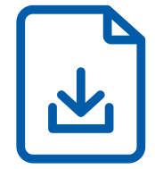

  

Flexibles Baukastenprinzip für individuelle Lösungen  

# VORTEILE, MIT DENEN SIE AUS DEM VOLLEN SCHÖPFEN  

# Das ABUS Hängebahnsystem  

Die konstruktiven und praktischen Vorteile des ABUS Hänge­ bahnsystems bedeuten handfeste Nutzenvorteile für Anwen­ der und An­wendungen:  

Die Konzeption als Baukastensystem erlaubt eine maßgeschneiderte und zugleich ökonomische Ver­ wirklichung von Anwendungslösungen.  

Durch die Vielfalt der Aufhängungsvarianten sind Installationen auch unter Bedingungen machbar, die „man kaum für möglich gehalten hätte“.  

Das vorteilhafte Zusammenspiel aller System-Kompo­ nenten. So trägt zum Beispiel die be­sonders niedrige Bauart des ABUS Elektro-Kettenzugs, in Verbindung mit der Zweischienenkatze des Hängebahnsystems (Bauarten Zweischienenbahn, ZHB, ZHB-X, ZHB-I ), zu einer optimalen Raum­ausnutzung und Zugewinn an höchster Haken­stellung bei.  

Die Tragfähigkeit ist individuell wähl- und oft auch aus­ baubar: bis $2000\,{\mathsf{k g}}$ .  

Die Beschränkung der Bauteile auf ein Minimum ver­ einfacht die Montage, spart Zeit und hilft Fehler zu vermeiden – gerade auch bei der Selbstmontage durch eigene Fachkräfte.  

Spezielle Werkzeuge sind zur Montage nicht erfor­ derlich.  

Die prinzipiellen Vorteile des ABUS Hängebahnsystems behalten ihren Wert auch für die Zeit nach der ersten Installation: Änderungen, Modernisierungen, Aufrü­ stungen und auch Wartungsarbeiten lassen sich ratio­ nell und kostengün­stig verwirklichen.  

Die ABUS typischen, verwechslungsfreien Steckverbin­ dungen machen die Elektroinstallation schnell und sicher.  

  

  
1   ABUS Einschienenbahn 2   ABUS Einträgerkran EHB 3   ABUS Zweiträgerkran ZHB  

Die Vielfalt an elektrischer Unterstützung, die ABUS Fahrantriebe und Hebezeuge zu bieten haben, bringen nicht nur Rationalität, sondern auch Sicherheit mit sich.  

# WIR LIEFERN DIE GESAMTLÖSUNG: KRANANLAGE UND OBERKONSTRUKTION  

  

# Fertigung  

Hier stimmt jeder Handgriff. Die Herstellung der Ober­ konstruktionen erfolgt ausschließlich durch qualifizierte Mitarbeiter. Die Schweißarbeiten werden von geprüften Schweißern durchgeführt. ABUS verfügt über die Herstel­ lerqualifikation zum Schweißen von Stahlbauten. Die Lie­ ferung erfolgt mit CE-Kennzeichnung gemäß EN 1090-1.  

# Engineering  

  

Sie nennen uns den Anwendungsfall und wir kümmern uns um alles Weitere. Können keine standardisierten Lösungen eingesetzt werden, so konzipieren wir eine individuelle Lösung, die den Einsatz der Krananlage bei Ihnen ermöglicht. Die Ausführung der Stahlbauten erfolgt in Übereinstimmung mit den einschlägigen Normen und Regelwerken.  

  

# Lieferung  

Bei ABUS bekommen Sie alles aus einer Hand. Kranan­ lage und Oberkonstruktion werden parallel gefertigt und können so zeitgleich mit einer Lieferung bereit­gestellt werden. Zusätzlicher Koordinationsaufwand bleibt Ihnen somit erspart.  

# Montage  

Vertrauen Sie bei der Montage auf die Erfahrung unserer Fachmonteure. Die Montage be­inhaltet eine vorherige, technische Klärung der Kran­anlage und Oberkonstruktion, damit bei der Montage alles passt und Montagezeiten kurz gehalten werden können.  

  

# KRANLÖSUNGEN AUS EINER HAND  

ABUS Einträgerkran EHB  

# Krananlagen  

Das Hängebahnsystem gehört zu den erfolgreichen Ideen in der Hebe- und Fördertechnik. Es verbindet die Qualitäten eines stationären Hebezeugs mit der Mobilität eines Laufkrans – und das auf ökonomische Art und Weise.  

Schließlich sind bei ABUS alle Voraussetzungen für die Ent­ wicklung des Hängebahnsystems im eigenen Hause vorhan­ den: die Erfahrung mit Hebezeugen und Laufkranen genauso wie hochwertige Fertigungstechnik und nicht zuletzt das Engagement für immer mehr Erleichterung und Mensch­ lichkeit am Arbeitsplatz. Aufgabe für ABUS war und ist, das Hängebahnsystem mit so vielen Vorteilen wie nur möglich auszustatten – und das möglichst preisgünstig. Jeder, der am Arbeitsplatz, im Lager, in Werkstatt oder Produktion Hilfe beim Heben und Transportieren von Lasten braucht, soll ABUS Hängebahn-Anlagen einsetzen und sich auch leisten können. Heute repräsentiert das ABUS Hängebahnsystem in Technik, Wirtschaftlichkeit, Flexibilität, Qualität und auch Arbeits­ platzfreundlichkeit eine Leistungsvielfalt, der die volle Aner­ kennung des Marktes gehört. Das Erfolgsrezept hierfür ist, Anwenderwünsche individuell zu erfüllen.  

  

  

Maß- und Datenblätter zum ABUS HB-Programm bitte hier anfordern: https://www.abus-kransysteme.de/kontakt/kontaktformular  

ABUS Zweiträgerkran ZHB  

# Oberkonstruktionen  

Unabhängig davon, wie Ihre Deckenkonstruktion aussieht oder wenn ein separater Stahlbau erforderlich ist, das Hängebahn­ system bietet für nahezu jede Gegebenheit eine passende Befestigungslösung. Ob als standardisierte Oberkonstruktion, mit kurzen Lieferzeiten, oder als individuell ausgelegter Stahl­ bau, Sie benötigen nur einen Ansprechpartner – ABUS.  

Weitere Produktdetails und eine Preisanfrage online unter: https://www.abus-kransysteme.de/krane/haengebahnsysteme  

  

# ERFOLGREICHE PROFILIERUNG – IN NEUEM DESIGN  

# Innenläuferprofile  

Der komplette Traglastbereich des ABUS Hängebahnsystems bis $2000\,{\mathsf{k g}}$ wird durch sechs Profiltypen abgedeckt.  

Mit höchster Präzision und in einem Vorgang gewalzte Stahl­ profile sowie im Strangpressverfahren hergestellte Alu­ miniumprofile sorgen für höchste Laufflächenqualität und leichtgängigen Anlagenbetrieb. Selbst besondere Einsatz­ bedingungen, wie Feuchtigkeit, leicht aggressive Medien oder Reinraum­anforderungen, stellen für die verzinkten bzw. eloxierten Profile keine große Herausforderung dar. ABUS hat sich für Innenläuferprofile entschieden, weil sie einen wirkungsvollen Fahrwerkschutz und zudem War­tungs­vor­teile bieten. Und noch zwei weitere wichtige Vorteile haben sie auf­ zuweisen: Durch ihre guten Querschnittseigen­schaften lassen sich große Aufhängeabstände reali­sieren – auch im höheren Traglastbereich. Die biegesteifen Stoßverbindungen der Profile sind genauso belastbar wie die Profile selbst. Dies ermöglicht Kranbahnen mit wenigen Stößen unabhängig von den statisch erforderlichen Aufhängepositionen. Beide Vorteile verringern den Aufwand für die Instal­lation des ABUS Hängebahnsystems erheblich und erhöhen seine Flexibilität.  

Und sie erleich­tern die Arbeit: Das Verfahren von Kranen und Katzen ist im Handbetrieb mit wenig Kraftaufwand möglich.  

# VIEL KRAFT GEHÖRT DAZU  

# ABUS Elektro-Kettenzüge  

Kraftspender aller ABUS Hängebahn-Anlagen sind die ABUS Elektro-Kettenzüge ABUCompact. Frisches Design und ein überzeugendes technisches Konzept kennzeichnen die Hebe­ zeuge der ABUS Kettenzug Generation ABUCompact. Die Kettenzüge GM2, GM4 und GM6 bieten Ihnen bei $3\mathsf{P h}/400\,\mathsf{V}$ in Verbindung mit Hängebahn-Anlagen zuverlässige Kraftpakete für Tragfähigkeiten bis $2000\,{\mathsf{k g}}$ in besonders niedriger Bauart für optimale Raumausnutzung und mit Feinhub für behutsames Heben und Senken auch empfindlicher Güter.  

Abgerundet wird die ABUCompact Baureihe durch den kleinen GMC. Mit stufenloser Hubgeschwindig­keit bei 125 oder $250\,{\mathsf{k g}}$ und an­schlussfertiger Lieferung für die 230 V-Steckdose ist er der ideale Kettenzug für den flexiblen Einsatz zum Heben geringerer Lasten.  

Der modulare Aufbau von Motor und Getriebe eröffnet die Plattform für ein umfangreiches Variantenangebot mit Hub­ geschwindigkeiten bis zu $20\,\mathsf{m}/\mathsf{m i n}$ oder FEM-Einstufungen bis 4m – zu überzeugenden Preisen. Hinzu kommen Vorteile, die der Praktiker besonders zu schätzen weiß: minimierter Wartungsaufwand durch Bremsbeläge mit besonders hohen Standzeiten (im Normalfall 1 Mio. Volllastbremsungen bis zum ersten Nachstellen), Lebensdauerschmierung des Präzisions­ getriebes, nachstellbare Rutschkupplung, spezialgehärtete verschleißarme Kette, Steckverbindungen für sichere Montage bzw. Revision und vieles mehr. Bei dem HB-System werden sie sicher ins Fahrwerk und Katzrahmen eingehängt und sind per Steckverbindung sofort betriebsbereit.  

  

# Aufhängung  

Der Aufhängung haben die ABUS Ingenieure besonders viel Aufmerksamkeit geschenkt. Die gummigelagerte Aufhän­ gung ist von oben in den Profilkopf einsetzbar. Dies mini­ miert den Montageaufwand insbesondere bei Erweiterungen und Auflastungen bestehender Anlagen sowie im Servicefall. Alle Bauteile zur Höheneinstellung sind über gut sichtba­ re Federstecker gesichert. Die hochbelastbare, patentierte Gummilagerung ist verschleißfrei und macht die Aufhängung somit weitestgehend wartungsfrei. Darüber hinaus wirkt sie schwingungsdämpfend und reduziert das Pendeln der Anlage. Zur Befestigung an der Decken­konstruktion oder an ande­ren Hallenelementen stehen eine ganze Reihe unter­schiedlicher Anschlussmöglichkeiten zur Verfügung. Deckenanschluss und Aufhängungsteil ermöglichen gemeinsam die Lösung des Pro­ blems mit dem ABUS Hängebahnsystem unter nahezu allen Bedingungen.  

  

  

# ABUS Fahrantriebe  

Treibende Kraft des Hängebahnsystems ist ganz nach Bedarf der ABUS Reibradantrieb HBF. Er zeichnet sich durch seine weichen Motorkennlinien und durch seine sanf­ten Anfahr- und Bremsbewegungen aus. Standardmäßig ist er immer mit je einer Haupt- und Feinfahrgeschwindigkeit ausgestattet.  

Nahezu unverzichtbar als hilfreicher und zuverlässi­ ger Bestandteil des ABUS Hängebahnsystems ist er bei Tragla­sten über $1000\,{\mathsf{k g}}$ und Kranträgerlängen von mehr als 6 m. Durch seine kompakte Bauweise kann er in Verbin­ dung mit Zweischienenkatzen in die Katze selbst inte­ griert werden. So entstehen keine Katzanfahrmaßver­luste. Sowohl bei ABUS Elektro-Kettenzügen als auch bei ABUS Reibradfahrantrieben HBF sind ABULiner einsetzbar, die mit der Frequenzumrichtertechnik stufenlose Hub- und Fahr­ geschwindigkeiten ermöglichen.  

  

HB-Fahrantrieb  

  
Weitere Produktdetails und eine Preisanfrage online unter: https://www.abus-kransysteme.de/krane/haengebahnsysteme  

# VARIATIONEN EINES STARKEN ANGEBOTS  

  

  
ABUS Einschienenbahn  

Linearer Transport Tragfähigkeit: bis 2 t  

•Niedrige Bauhöhe •	 Große Aufhängeabstände •Elektrisch verfahrbar (Option)  

  

# ABUS Einträgerkran EHB  

Flächendeckender Transport Tragfähigkeit: bis 1,25 t Kranträgerlänge: bis $10\,\mathsf{m}$ (je nach Tragfähigkeit)  

•	 Sehr geringes Eigengewicht, ideal für Leichtbauhallen   
•	 Gut von Hand verfahrbar   
•	 Niedrige Bauhöhe   
•	 Geringe Anfahrmaße   
•	 Große Aufhängeabstände  

# ABUS Zweischienenbahn  

Linearer Transport Tragfähigkeit: bis 2 t  

•	 Große Aufhängeabstände   
•	 Besonders günstige Hubhöhe durch Anordnung des Ketten­­zuges zwischen den Bahnsträngen   
•	 Sehr niedrige Bauhöhe   
•	 Elektrisch verfahrbar (Option)   
•	 Bedienung verfahrbar (Option)  

  

# ABUS Einträgerkran EHB-X  

Flächendeckender Transport Tragfähigkeit: bis 1 t Kranträgerlänge: bis 8 m (je nach Tragfähigkeit)  

•	 Optimale Ausnutzung der Raumhöhe durch aufgebockten Kran   
•	 Gut von Hand verfahrbar   
•	 Sehr niedrige Bauhöhe   
•	 Geringe Anfahrmaße   
•	 Große Aufhängeabstände   
•	 Elektrisch verfahrbar (Option)   
•	 Bedienung verfahrbar (Option)  

  

# VARIATIONEN EINES STARKEN ANGEBOTS  

  

  

# ABUS Zweiträgerkran ZHB  

Flächendeckender Transport Tragfähigkeit: bis 2 t Kranträgerlänge: bis $12\,\mathsf{m}$ (je nach Tragfähigkeit)  

•	 Große Aufhängeabstände   
•	 Sehr niedrige Bauhöhe   
•	 Besonders günstige Hubhöhe durch Anordnung des Kettenzuges zwischen den Kranträgern   
•	 Elektrisch verfahrbar (Option)   
•	 Bedienung verfahrbar (Option)  

  

# ABUS Einträgerkran EHB-I  

Flächendeckender Transport Tragfähigkeit: bis 1 t Kranträgerlänge: bis $10\,\mathsf{m}$ (je nach Tragfähigkeit)  

•	 Sehr geringes Eigengewicht, ideal für Leichtbauhallen   
•	 leicht von Hand verfahrbar   
•	 Kranbahn aus Standard-Walzprofilen   
•	 Geringe Anfahrmaße  

# ABUS Zweiträgerkran ZHB-X  

Flächendeckender Transport Tragfähigkeit: bis 2 t Kranträgerlänge: bis 8 m (je nach Tragfähigkeit)  

•	 Optimale Ausnutzung der Raumhöhe durch aufgebockten Kran   
•	 Sehr niedrige Bauhöhe   
•	 Große max. Aufhängeabstände   
•	 Elektrisch verfahrbar (Option)   
•	 Bedienung verfahrbar (Option)  

  

# ABUS Zweiträgerkran ZHB-I  

Flächendeckender Transport Tragfähigkeit: bis 2 t Kranträgerlänge: bis $12\,\mathsf{m}$ (je nach Tragfähigkeit)  

•	 Hohe Tragfähigkeit   
•	 Besonders günstige Hubhöhe durch Anordnung des Kettenzugs zwischen den Kranträgern   
•	 Kranbahn aus Standard-Walzprofilen   
•	 Elektrisch verfahrbar (Option)   
•	 Bedienung verfahrbar (Option)  

  

Weitere Produktdetails und eine Preisanfrage online unter: https://www.abus-kransysteme.de/krane/haengebahnsysteme  

# DIE BAUTEILE DES ABUS HÄNGEBAHNSYSTEMS  

  

# FLEXIBLES BEFESTIGUNGSKONZEPT  

  

# Kragarmstützen  

Kragarmstützen sind die günstige Alternative zu Portalen. Sie werden in individuellen Bauhöhen gefertigt und lassen sich mit wenig Montageaufwand zügig aufstellen. Es gibt sie mit einseitiger und beidseitiger (T-Stütze) Auskragung für die Befestigung der Kranbahnen.  

  

  

# Hilfsträger  

Hilfsträger schaffen zusätzliche Aufhängepositionen zur Ab­hängung der HB-Anlage. Sie werden frei gespannt an den Unterzügen der Halle befestigt und ermöglichen die Über­ brückung auch großer Ab­stände.  

  

  

# Normalkonsolen  

Normalkonsolen werden seitlich an den Hallenbindern befes­ tigt. Die Befestigung erfolgt mittels Durchgangs­ankern. Es gibt sie sowohl für Beton- als auch für Holzbinder und mit unter­ schiedlich langen Ausladungen.  

  

# FLEXIBLES BEFESTIGUNGSKONZEPT  

  

  

# Binderkonsolen  

Binderkonsolen ermöglichen den Anschluss der Hänge­ bahn-Anlage direkt unterhalb der Tragkonstruktionen von Hallendecken. Die Binder werden von der Seite durchbohrt und müssen somit für die Montage nicht von oben zugänglich sein. Binderkonsolen gibt es für Holz- und Stahlbetonbinder mit rechteckigen Querschnitten und für Stahlbetonbinder in PI-Ausführung.  

# Umklammerungskonsolen  

Umklammerungskonsolen um­fassen die Hallenbinder, ohne dass diese durchbohrt werden müssen.  

Die seitlichen Gewindestangen sind in der Länge variabel und ermög­lichen die Verwendung auch bei großen Binderhöhen. Je nach Dachkonstruktion lassen sich Umklammerungskon­ solen auch bei auf dem Hallenbinder aufliegenden Dächern montieren.  

  

  
Diese Binderformen können umklammert werden.  

# FLEXIBLES BEFESTIGUNGSKONZEPT  

  

  

  

# Portalkonstruktionen  

Individuell angepasste Portal­konstruktionen bieten Lösungen, wenn z.B. die Deckenkonstruktion nicht zur Befestigung der Hängebahn-Anlage geeignet ist. Es gibt sie freistehend oder auch mit seitlichen Anbindungen an die Hallen­konstruktion.  

Damit die Arbeitsbereiche unter den Hängebahn-Anlagen gut zugänglich bleiben, werden ggf. erforderliche Versteifungen möglichst hoch angebracht und die Stützabstände zwischen den Portalen dahin­gehend optimiert.  

  

# Profilabhängungen  

Profilabhängungen kommen zum Einsatz, wenn zwischen Decke und Krananlage große Abhängehöhen bestehen. Sie werden mit Dübeln, durch Klemmen oder Verschrauben an den vorhandenen Tragwerken befestigt. Profilabhängungen sind eine Alter­native zur Abhängung mit sehr langen Gewin­ destangen. Sie redu­zieren das Pendel­verhalten deutlich. Zusätzliche Versteifungen gegen das Pendeln sind damit nicht mehr erforderlich.  

  

# Komplettlösungen aus dem Hause ABUS  

  

Weitere Produktinformationen zu unserem gesamten Lieferprogramm finden Sie unter: www.abus-kransysteme.de/downloads  

H E R A U S G E B E R  

ABUS Kransysteme GmbH   
Postfach 10 01 62   
51601 Gummersbach   
Telefon: 02261 37-7776 bis -7778   
E-Mail: anfrage@abus-kransysteme.de  