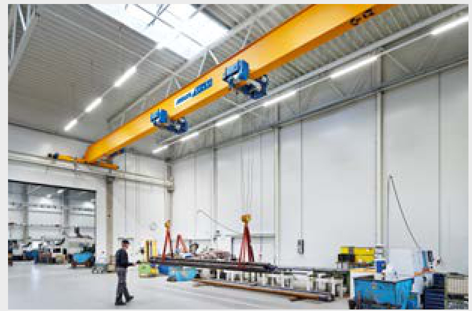
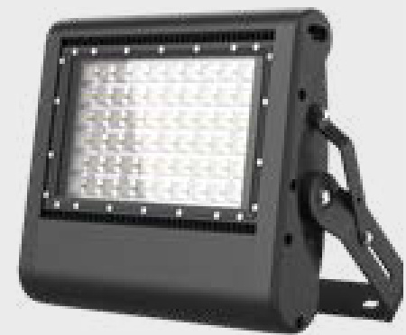
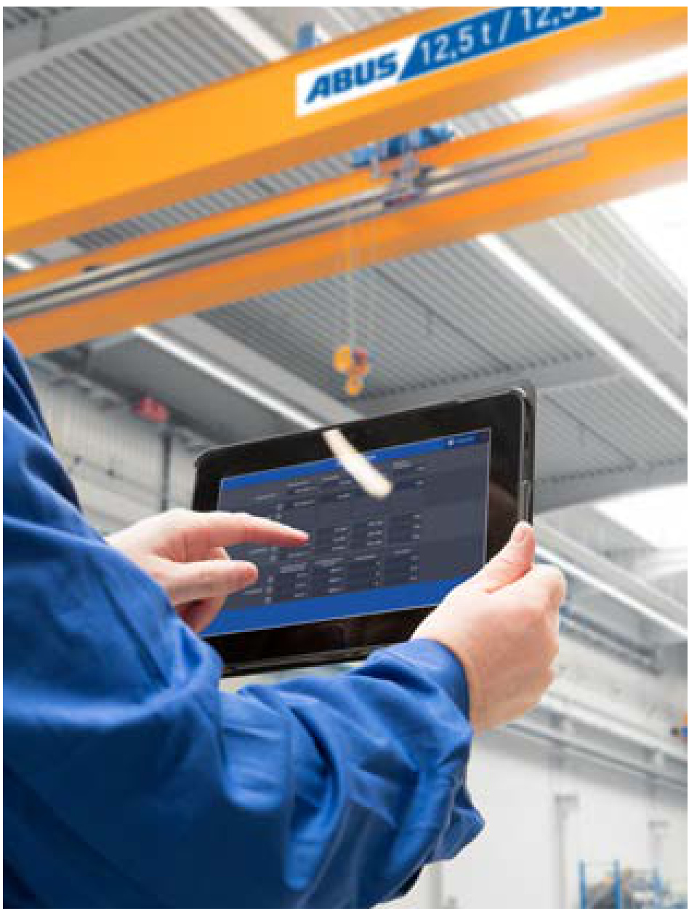
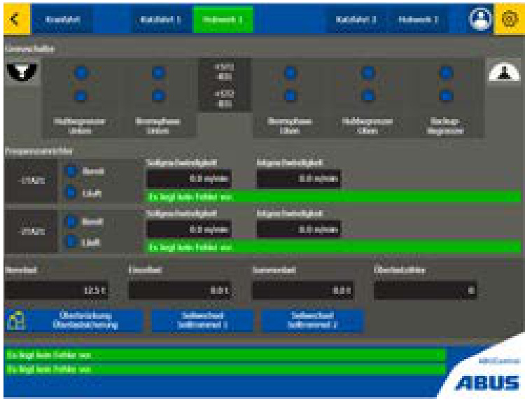

  

# WIR MACHEN IHNEN DAS HEBEN LEICHTER.  

  

# ABUS Laufkrane  

überzeugen in jedem Fall durch beispielhafte Flexibilität und Zuverlässigkeit und verfügen über Ausstattungsmerkmale, die längst nicht überall Standard sind. Ob Heben und Senken, flächendeckender oder linearer Transport – mit ABUS haben Sie jede Bewegung im Griff. ABUS Laufkrane heben Lasten bis zu 120 t und sind damit die ideale Lösung für besonders schwere Aufgaben und große Spannweiten. Das ABUS Laufkransortiment umfasst fünf verschiedene Bauarten für verschiedene Einsatzbereiche und Betriebsvoraussetzungen: Einträgerlaufkrane, Zweiträgerlaufkrane, Deckenlaufkrane, Einträger-Wandlaufkrane und Einträger-Halbportalkrane.  

ABUS zählt zu den europaweit führenden Herstellern von Hallenkransystemen und bietet seinen Kunden maßgeschneiderte Lösungen für wirtschaftlichen Material-­ fluss sowie individuellen Service von der Planung bis zur Wartung. In jedem dieser Bereiche steht der Name ABUS seit über fünf Jahrzehnten für Qualität und Präzision bis ins kleinste Bauteil. ABUS Hallenkransysteme decken den gesamten Lastenbereich von $500\,{\mathsf{k g}}$ bis 120 t ab und lassen sich den unterschiedlichsten Hallengeometrien und Systemanforderungen perfekt anpassen. Mit dem umfangreichen Programm an Zusatzausstattungen sind ABUS Krane dabei auch für spezielle Einzelfälle bestens gerüstet,  

# ABUS Einträgerlaufkrane ELK, ELV & ELS  

  

garantieren auch dort optimalen Materialfluss, wo die räumlichen Verhältnisse in Produktionshalle oder Lager Kransystemen nur wenig Platz bieten. ABUS Einträgerlaufkrane stehen als Ausführung mit Walzprofilträger und geschweißtem Kastenträger zur Verfügung. Jeder Typ lässt sich mit entsprechenden Einbauvarianten Platz sparend einsetzen und ermöglicht eine Optimierung der höchsten Hakenstellung.  

  

# ABUS Zweiträgerlaufkrane ZLK  

erzielen mit bis zu 120 t die höchste Tragfähigkeit. Sie stehen in verschiedenen Ausführungen zur Verfügung und bieten optimale Voraussetzungen für zusätzliche Anforderungen. So sind zum Beispiel größere Tragfähigkeiten, Spannweiten und Hakenwege, sowie ein erweitertes Spektrum für höhere Kraneinstufen möglich.  

# ABUS Deckenlaufkrane DLVM & EDL  

  

bieten Lösungen für besondere Hallenverhältnisse, bei denen die Kranbahn nicht auf Stützen, sondern an der Hallendecke befestigt wird. Geringe Katzanfahrmaße ermöglichen dabei die bestmögliche Nutzung der Hallenbreite.  

# ABUS Einträger-Wandlaufkrane EWL  

  

und ABUS Einträger-Halbportalkrane werden auf eigenen Kranbahnen unterhalb anderer Laufkrantypen in der zweiten Hallenebene eingesetzt und sind die ideale Lösung, um mehrere Arbeitsplätze gleichzeitig bedienen zu können. Der ABUS Einträger-Wandlaufkran erreicht Ausladungen bis zu $12\,\mathsf{m}$ und eine Tragfähigkeit bis zu 5 t.  

  

# ABUS Einträger-Halbportalkrane EHPK  

erreichen Spannweiten von bis zu $15\,\mathsf{m}$ und eine Trägfähigkeit bis zu 10 t und sind für den Einsatz auf eigener Kranbahn in der zweiten Ebene unterhalb anderer Laufkrantypen optimal einsetzbar. Ideal auch als Arbeitsplatzkran für mehrere Stationen.  

  

ABUS Einträgerlaufkrane ELV, ELK und ELS  

# HOHES NIVEAU AUCH IN NIEDRIGEN HALLEN.  

Mit den ABUS Einträgerlaufkranen lassen kenstellungen. Für die Neubauplanung ist sich auch in niedrigen Hallen rationelle die Einbauvariante 3 (siehe EinbauvarianMaterialflusslösungen mit Tragfähigkeiten Seite 7) die optimale Lösung, da hier ten bis zu 16 t und Spannweiten bis zu $39\,\mathsf{m}$ die kleinsten Katzanfahrmaße realisiert realisieren. Da für Einträgerlaufkrane in werden. Darüber hinaus ermöglicht das diesem Lastbereich in der Regel kein SiABUS Zubehörprogramm mit speziellen cherheitsabstand zur Gebäudedecke vorZusatzausstattungen eine Vielzahl von geschrieben ist, können auf diese Weise Sonderlösungen. Als Kranträger dienen die räumlichen Gegebenheiten optimal beim ABUS Einträgerlaufkran ELV robusgenutzt und Kosten für zusätzlichen umte  Profilträger, bei den ABUS Einträgerbauten Raum eingespart werden. Die laufkranen ELK und ELS torsionssteife, ABUS Einträgerlaufkrane werden hierbei geschweißte Kastenträger. Die Seitenmit speziellen Einbauvarianten den jeweilaufkatze beim ABUS Einträgerlaufkran ligen Raum- und Platzverhältnissen indiELS sorgt darüber hinaus für eine optimaviduell angepasst und erzielen durch ihre le Ausnutzung der Hubhöhe. günstigen Baumaße optimal höchste Ha  

# HOHES NIVEAU AUCH IN NIEDRIGEN HALLEN.  

  

# HAUPTTRÄGER-EINBAUVARIANTEN ZUR ANPASSUNG AN DIE JEWEILIGEN HALLENVERHÄLTNISSE  

  
Darstellung für ELV und ELK  

# HOHES NIVEAU AUCH IN NIEDRIGEN HALLEN.  

  

  

Die ideale Lösung für Hallenneubauten: der ABUS Einträgerlaufkran ELK mit an die Voute angepasster Hauptträgerschräge. Auf diese Weise wird die verfügbare Hallenhöhe optimal genutzt.  

  

Bei besonderen architektonischen Situationen und baubedingten Vorgaben bieten aufgebockte Kranbrücken optimierte Einbaulösungen.  

Optional: seitliche Führungsrollen zur engeren Führung des Krans an einem Kranbahnstrang. Die Spurführungskräfte werden reduziert.  

  

Optionaler Zweikatzbetrieb für den Transport von besonders schweren und sperrigen Lasten. Die Steuerung der Seilzüge erfolgt von der Kransteuerung aus wahlweise einzeln oder gemeinsam. Ein echter Zugewinn an Sicherheit für Ihre Transportaufgabe.  

  

  

ABUS Zweiträgerlaufkrane ZLK  

# EXPERTEN FÜR SCHWERE FÄLLE.  

Doppelt ist stärker, und so sind die ABUS fügung. Sämtliche Profile der Haupt- und Zweiträgerlaufkrane erste Wahl beim flä- Fahrwerksträger sind computeroptimiert chendeckenden Transport großer Lasten und verbinden so maximale Leistungs­ bis zu 120 t. Wie alle ABUS Hallenkrane fähigkeit und geringes Eigengewicht. Vorsind sie durch unterschiedliche Einbauvateile, die sich statisch und finanziell ausrianten in geplante oder bestehende Halzahlen. ABUS Zweiträgerlaufkrane sind lenkonstruktionen perfekt zu integrieren mit Spannweiten bis zu $42\,\mathsf{m}$ realisierbar und garantieren jederzeit ein Höchstmaß und bieten die besten Voraussetzungen bei an Funktionalität, Flexibilität und Sicherzusätzlichen Anforderungen, wie zum Beiheit. Das ABUS Zubehörprogramm bietet spiel höhere Kraneinstufungen, die Instaldarüber hinaus eine Vielzahl von Sonderlation von Wartungslaufbühnen oder Hilfsausstattungen für spezielle Lösungen. hubwerke.   
ABUS Zweiträgerlaufkrane stehen als ZLK   
mit geschweißtem Kastenträger zur Ver  

# EXPERTEN FÜR SCHWERE FÄLLE.  

  

# HAUPTTRÄGER-EINBAUVARIANTEN ZUR ANPASSUNG AN DIE JEWEILIGEN HALLENVERHÄLTNISSE  

  

# EXPERTEN FÜR SCHWERE FÄLLE.  

  

  

Bei Fahrten ins Freie sorgt eine über den ABUS Laufkran bediente Schaltung für die Steuerung der Kranklappenverriegelung.  

  

Beim Transport von langen und sperrigen Gütern sorgen zwei gleichlaufende Krane für ein risikofreies Lastenhandling.  

Abgesenkte Katzbauarten ermöglichen den Einsatz von Zweiträgerlaufkranen bei geringem Freiraum oberhalb der Kranbahn. Auch die höher positionierte Kranbrücke bei Wahl einer abgesenkten Katze kann den entscheidenden Vorteil bringen – beispielsweise beim Transport sperriger Maschinen oder großvolumiger Behälter.  

  

Die Ausstattung der Krane mit Wartungslaufbühne bietet optimale Erreichbarkeit aller Elemente und damit entscheidende Vorteile gerade bei der Durchführung von Wartungsarbeiten.  

  

  

Durch die Lagerung des Fahrwerksträgers auf acht Rädern wird eine besonders günstige Lastverteilung erzielt. Damit können bei gleicher Kranbahn größere Lasten transportiert und eine sonst erforderliche Verstärkung bei vorhandenen Hallen gegebenenfalls vermieden werden.  

  

Optionaler Zweikatzbetrieb für den Transport von besonders schweren und sperrigen Lasten. Die Steuerung der Seilzüge erfolgt von der Kransteuerung aus wahlweise einzeln oder gemeinsam. Ein echter Zugewinn an Sicherheit für Ihre Transportaufgabe.  

  

#  

ABUS Deckenlaufkrane DLVM, EDL und EDK  

# LEISTUNG UNTER BESONDEREN UMSTÄNDEN.  

Komplizierte Hallenverhältnisse erforaus. Durch das Einschieben des Hauptträ- dern spezielle Lösungen. Und die sind mit gers zwischen die Fahrwerksträger kann den ABUS Deckenlaufkranen ganz unaußerdem die höchste Hakenstellung verkompliziert zu realisieren. Denn durch die bessert werden. ABUS Deckenlaufkrane Montage der Kranbahn unter der Hallenbieten Tragfähigkeiten bis 8 t und Spanndecke statt auf Stützen bieten sie hochweiten bis $25\,\mathsf{m}$ . Sie sind in den Ausfühwertige Lösungen auch unter schwierigen rungen DLVM und EDL mit Walzprofilträ- Platz- und Konstruktionsbedingungen. ger sowie EDK mit torsionssteifem ABUS Deckenlaufkrane nutzen durch die Kastenträger erhältlich. Auch für  die geringen Katzanfahrmaße und eine indiviABUS Deckenlaufkrane steht ein umfangduelle Anpassung der Überstände die zur reiches Programm an ZusatzausstattunVerfügung stehende Hallenbreite optimal gen zur Verfügung.  

# LEISTUNG UNTER BESONDEREN UMSTÄNDEN.  

  

# HAUPTTRÄGER-EINBAUVARIANTEN ZUR ANPASSUNG AN DIE JEWEILIGEN HALLENVERHÄLTNISSE  

  
Darstellung für EDL und EDK  

  

#  

ABUS Einträger-Wandlaufkran EWL  

# ERSTKLASSIG IN DER ZWEITEN EBENE.  

Der ABUS Einträger-Wandlaufkran beMit rechtwinkligen Koordinaten kann er wegt sich auf einer eigenen Ebene unterhierbei mehrere Arbeitsplätze gleichzeitig halb der großen Laufkrane. Damit setzt er bedienen. Den ABUS Einträger- Wandlaufden reibungslosen Materialfluss durch zukran gibt es in Ausführungen bis 5 t Tragsätzliche Fördermöglichkeiten in anderen fähigkeit und Ausladungen bis $12\,\mathsf{m}$ .Produktionsbereichen konsequent fort.  

# ERSTKLASSIG IN DER ZWEITEN EBENE.  

  

EWL Einträger-Wandlaufkran mit geschweißtem Kastenträger  

Durch den Einsatz von zwei Hubwerken im Tandembetrieb lässt sich mit dem ABUS Einträger-Wandlaufkran auch Langgut sicher positionieren.  

  

  

  

#  

ABUS Einträger-Halbportalkran EHPK  

# EIN STARKER HELFER IN DER ZWEITEN EBENE.  

Der ABUS Einträger-Halbportalkran ist rung der Portalstütze am Hallenboden. der ideale Arbeitsplatzkran in einer EbeDas untere Fahrwerk befährt entweder ne unterhalb der Hallenbekranung. Ähndirekt den ebenen und tragfähigen Hallelich wie der ABUS Einträger-Wandlaufboden oder, bei höheren Radlasten, eine kran ist er aufgrund seiner rechtwinkligen niveaugleich zum Hallenboden eingelasFahrstreckenkoordinaten in der Lage sene und tragfähige Stahllaufbahn. Eine mehrere hintereinander liegende Arbeitserhabene oder versenkte Führungsschieplätze zu bedienen. Der ABUS Einträgerne und damit entstehende Störkonturen Halbportalkran ist in Ausführungen bis zu entfallen. Abhubsicherungen am oberen 10 t Tragfähigkeit und bis zu 15 m SpanKranfahrwerk sind beim EHPK genauso weite erhältlich. Die verwindungssteife selbstverständlich wie eine Hinderniserund stabile Kastenträger-Bauweise erkennung und gut sichtbare Rundumleuchlaubt ein Verfahren ohne seitliche Fühten auf Flurniveau.  

# EIN STARKER HELFER IN DER ZWEITEN EBENE.  

  

  

# DIE GRUNDAUSSTATTUNG DER ABUS LAUFKRANE: EIN BEISPIELHAFTER STANDARD.  

# ABUS Qualität – bis ins Detail.  

Bereits in der Grundausstattung bieten ABUS Laufkrane einen besonders hohen Leistungsstandard. Denn sie umfasst serienmäßig viele Komponenten, die längst nicht selbstverständlich sind und den Betrieb der ABUS Laufkrane nicht nur besonders sicher und zuverlässig machen, sondern auch die optimale Anpassung an individuelle Anforderungen ermöglichen. Wie die ABUS Krane selbst erfüllt jede Komponente höchste Qualitätsansprüche und ist in ihrer Funktion auf Herz und Nieren getestet.  

# Motorschutzschalter  

bieten zusätzliche Sicherheit bei Kranen mit ABUS Seilzügen durch die Begrenzung der thermischen Belastung der Kran- und Katzfahrmotoren bei Zweiphasenlauf, starkem Tippbetrieb und blockiertem Antrieb. Nach dem Auslösen der Schutzfunktion ist die Wiederinbetriebnahme ohne Sicherungsaustausch möglich.  

# ABUS Steckverbindungen  

stellen einfach und sicher zuverlässigen Kontakt her. Sie sind bereits vorinstalliert und reduzieren dadurch Montageund Wartungsarbeiten auf ein Minimum. So sind zur Herstellung der elektrischen Verbindungen zu Hubwerken, Getriebemotoren und Steuerungen nur wenige Handgriffe nötig, das Hinzuziehen eines Elektrikers ist in diesen Fällen nicht notwendig.  

In der ABUS Schützsteuerung laufen alle Steuersignale zusammen. Die modular aufgebauten Komponenten ermöglichen eine anwendungsoptimierte Ausführung unter Beibehaltung größtmöglicher Flexibilität. Die Schnittstellen zu Standardoptionen (Funksteuerung, Signalhupe, Fahrgrenzschalter, Zusammenfahrsicherung...) sind anschlussfertig vorinstalliert. Das übersichtlich gestaltete Layout in Kanalverdrahtung bietet hohe Servicefreundlichkeit. Zeitglieder vermeiden unerwünschte Tippschaltung. Groß- zügig dimensionierte Leistungsschütze gewähren hohe Kontaktlebensdauer.  

  

  

  

  

# Funksteuerung  

Ermöglicht durch freie Standortwahl und mehr Bewegungsfreiheit für den Kranführer einen guten Überblick über das gesamte Arbeitsfeld und damit besonders zeitsparendes Arbeiten. Zur Steuerung steht der kompakte Handsender mit induktiver Ladestation zur Auswahl. Die ABURemote arbeitet mit Standard-Akkus – mehr als 40 Stunden am Stück.  

Lastanzeige im Display der Funksteuerung ABURemote Button. Das ABUS Lastindikatorsystem bietet ein umfassendes Leistungsspektrum von Schaltungs- und Überwachungsfunktionen. Das System zeichnet sich durch schnelle Reaktionszeiten, wie sie beispielsweise bei der Lasterkennung notwendig sind, aus. ABUS Seilzüge werden damit auf einfache Weise vor unzulässig hoher Belastung geschützt. Das Messprinzip ermöglicht am Hebezeug eine Lastbegrenzung ohne Verlust an Hakenhöhe.  

Die wesentlichen Funktionen im Überblick:   
- Überlastsicherung   
- Teillastschalter   
- Betriebsstundenzähler   
- Motorschutz durch Stromüberwachung   
- zusätzliche Sicherheit durch redundanten Schaltungsaufbau   
- Netz- und Fehlerdiagnose   
- generatorische Bremsschaltung zur Bremsverschleißreduzierung   
- Lastkollektivspeicher (Option)  

  

  

  

# ABUS ZUSATZAUSSTATTUNGEN: DAS BESTE FÜR INDIVIDUELLE LÖSUNGEN.  

Damit jeder ABUS Laufkran seine Aufgaben in jeder Hinsicht perfekt erfüllt, steht für die individuelle Konfiguration ein umfassendes Programm an ABUS Zusatzausstattungen zur Verfügung. Es bietet zusätzliche Sicherheitseinrichtungen und Funktionen von der elektrischen Endbegrenzung bis zur integrierten Lastauswertung sowie spezielle Konstruktionselemente von der Kranbeleuchtung bis zur Laufbühne.  

  

# Der ABULiner  

ermöglicht eine komfortable Lösung für alle Einsatzfälle, bei denen Hubwerke mit variabler Hubgeschwindigkeit für besonders exaktes Positionieren ausgestattet werden sollen. Mit diesem Frequenzumrichter kann außerdem die maximale Hubgeschwindigkeit bei reduzierter Last über die Nennhubgeschwindigkeit hinaus erhöht werden. Ebenfalls möglich ist der Einsatz des ABULiners beim Kran- und Katzfahren.  

  

# Die ABUS Tandemsteuerung  

bietet die Möglichkeit, zwei elektrisch gekoppelte Laufkrane zu steuern. Idealerweise werden hierzu ABUS Funksteuerungen eingesetzt. Dabei können wahlweise zwei Kranführer zwei Krane getrennt bedienen oder aber ein Kranführer beide Krane einzeln und gemeinsam steuern. Beim Transport von Langgut mit 2 Kranen ein echter Gewinn an Sicherheit.  

  

# LED Matrixanzeige  

mit drei unterschiedlichen Zifferngrößen von $60\,\mathsf{m m}$ bis $180\,\mathsf{m m}$ können sowohl Ziffern, Buchstaben als auch Sonderzeichen bis zu einer Ableseentfernung von ca. $80\,\mathsf{m}$ realisiert werden. Durch den geringen Platzbedarf ist ein variabler Anbau am Kran möglich. Auch Zustandsanzeigen des Krans sowie Laufschrift sind hiermit umsetzbar.  

  

# Über die ABUS Laufbühne  

sind Kranträger auf der gesamten Länge zugänglich und damit alle wichtigen Komponenten schnell und bequem erreichbar. Entscheidende Voraussetzungen für die zügige und sichere Durch­führung von Wartungsarbeiten.  

  

# ABUS Kranbeleuchtungen  

dienen zur perfekten Ausleuchtung des Arbeitsbereichs unterhalb des Krans. Ebenso lassen sich Schatten, die oft bei normaler Hallenbeleuchtung vom Kranträger geworfen werden, vermeiden. ABUS verwendet hocheffiziente energiesparende LED-Leuchten. Die Anzahl der Leuchten, sowie die Lichtstärke ergeben sich aus den Anforderungen des Kunden.  

  

# Lastaufnahmemittel  

ergänzen die ABUS Laufkrane bei besonderen Transportaufgaben. So können die Krane zum Beispiel für den Einsatz von Vakuumhebegeräten zur Aufnahme von Platten oder C-Haken für den Coil-Transport vorgerüstet werden.  

  

# ABUS Kreuzhebelschalter  

zur elektrischen Endbegrenzung bewirken die automatische Reduzierung oder Abschaltung der Fahrbewegung von Kranen und Katzen am Bahnende. Eine weitere Anwendung besteht bei Sperrzonen, die mit der Katze des Kranes nicht überfahren werden sollen. Die Betätigung erfolgt durch an der Bahn bzw. an der Kranbrücke befestigte Schaltnocken.  

  

# ABUS ZUSATZAUSSTATTUNGEN: DAS BESTE FÜR INDIVIDUELLE LÖSUNGEN.  

# Pendelreduzierte Bewegungsabläufe bei zweistufigem Betrieb  

Wer empfindliche Güter oder große Lasten optimal transportieren will, für den erweitert ABUS sein polschaltbares System um das Sanftanlaufgerät AZS und das Sanftumschaltrelais SU-2. Mit diesen elektronischen Baugruppen kann der Kranbediener das am Gerät einstellbare Beschleunigungsverhalten sowie die verbesserten Verzögerungseigenschaften zur sanften Steuerung der Kran- und Katzfahrt als Alternative zum Frequenzumrichter nutzen.  

# Die ABUS Zusammenfahrsicherung  

schützt Krane durch fotoelektrische Abstandsmessung vor einem versehentlichen Zusammenprall. Neben der serienmäßigen, automatischen Umschaltung auf langsame Fahrstufe bei Annäherung besteht zusätzlich die Möglichkeit der Endabschaltung. Darüber hinaus sind bei besonderen Anforderungen, zum Beispiel Einhaltung eines vorgegebenen Mindestabstands, Spezialausführungen lieferbar.  

Achtung: Nicht zur Distanzierung aus statischen Gründen geeignet! Hierfür kann das Lichtschrankensystem mit redundanten Komponenten und einer Prüf- und Störanzeige aufgebaut werden.  

# Geeichte Wägeunterflasche  

Zu wissen, was am Haken hängt, das ist für viele Kranbetreiber wichtig:  Waren abwiegen und an Kunden berechnen, LKWs beladen, Produktionsanlagen mit abgewogenem Material beschicken, Sicherheitsvorschriften für Lasten einhalten oder das Gewicht von Containern ermitteln – häufig ist die ABUS Wägeunterflasche die wirtschaftlich vorteilhafte Lösung. Sie ist eine digitale Handelswaage der Genauigkeitsklasse III mit EG-Zulassung der Physikalisch Technischen Bundesanstalt. Die Kranwaage wird geeicht und betriebsfertig geliefert. Die Wäge-Elektronik besteht aus moderner SMD Technologie in robuster Industrieausführung. Das Wägemodul integriert sich optimal in die Unterflasche von ABUS Seilzügen.  

  

  

  

  

# ABUCONTROL:  

# HEBT KRANE AUF EIN NEUES LEVEL  

  

  

#  

ABUS Krane mit ABUControl-Steuerung können über Fahrprofile auf Ihre Gegebenheiten angepasst werden. Krane mit zwei festen Geschwindigkeiten fahren z.B. völlig anders als frequenzumrichtergesteuerte Krane. Fahr- und Hubprofile ermöglichen die Anpassung der Krane an Ihre aktuelle bzw. gewünschte Situation. Damit entfällt bei vorhandenen Kranen der Umstellungsaufwand Ihrer Kranfahrer und sie spüren eher die gestiegene Produktivität durch die zusätzliche Krananlage.  

#  

Die ABUS Pendeldämpfung erhöht die Sicherheit und den Komfort beim Transport von Gütern in sensiblen Bereichen. Die Pendeldämpfung basiert auf mathematischen Berechnungen. Dabei werden die Fahrgeschwindigkeiten, Beschleunigung und Verzögerung von Kran und Katze, die Hakenposition und die Länge des Lastaufnahmemittels berücksichtigt. Auch Personen, die nur selten Krane bedienen, können mit Hilfe der Pendeldämpfung Lasten sicher transportieren.  

#  

Die ABUS Gleichlaufregelung von zwei Katzen an einem Kran ermöglicht sicheres Handling von langen Produkten. Ein Auseinanderlaufen der Hubgeschwindigkeiten wird durch ständige Regelung selbst bei unterschiedlichen Seilzügen wirkungsvoll unterbunden. Vorausgesetzt der Kran ist mit Frequenzumrichter Heben ausgerüstet. Auch bei Kranen, die im Tandem laufen, werden die Fahrgeschwindigkeiten geregelt. Zwei Krane, maximal vier Katzen und Hub, alles geregelt.  

  

  

Betriebsdaten, Einstellungen, Service-Informationen. Mittels der modernen Oberfläche KranOS behalten Sie den Kran im Auge. Kabellos von jedem Laptop oder Tablet mit Browser. Und die jährlich wiederkehrende Prüfung geht noch ein bisschen flotter.  

#  

  

ABUControl setzt auf bewährte, am freien Markt erhältliche Bauteile von namhaften Elektronikherstellern. Ein Austausch oder Reparatur bedingt weder „Herrschaftswissen“ noch „Softwarelizenzen“. Sie behalten zu jeder Zeit die vollständige Kontrolle über den Kran und die freie Wahl des Servicepartners. ABUControl - ein einzigartiges Versprechen für einfache Wartung und Reparatur.  

# ABUS DURCH UND DURCH: MODERNE PRODUKTION, TYPISCHE PRÄZISION.  

  

Die hohe Qualität der ABUS Kransysteme hat ihren guten Grund: die sorgfältige Fertigung in den ABUS Werken Lantenbach und Herreshagen. Von der Hochleistungsstrahlanlage zur Vorbereitung der Stahlbleche über Schweißanlagen mit automatischem Nahtfolgesystem bis zum Auftrag der hochwertigen Lacksysteme bieten hier unsere Produktionsanlagen Fertigungstechnik auf dem neuesten Stand. Durch die Verbindung eines hohen Automationsgrads mit maximaler Flexibilität garantieren wir so bei der Herstellung der Krane Präzision und Wirtschaftlichkeit auf einem gleich bleibend hohen Qualitätsniveau und können zugleich Krananlagen für unterschiedlichste Einsatzbereiche ganz individuell realisieren. Im eigenen Hause entwickelte, hoch spezialisierte Maschinen, wie zum Beispiel die verfahrbare Portalschweißanlage, sorgen hierbei für einen jederzeit reibungslosen Produktionsablauf und schnelle, termingerechte Fer­tigstellung bis zur Bereitstellung just in time. Klar, dass alle ABUS Krane und ihre mechanischen, elektrischen und elektronischen Komponenten auf Herz und Nieren getestet werden, bevor wir sie auf den Weg zu unseren Kunden bringen. So können Sie sich darauf verlassen, dass alles, was den Namen ABUS trägt, auch durch und durch ABUS ist.  

# EIN BILD VON QUALITÄT: ABUS KASTENTRÄGER.  

ABUS Laufkrane werden je nach Typ mit Walzprofilträgern oder Kastenträgern ausgerüstet. Während Walzprofilträger bei kleineren bis mittleren Tragfähigkeiten und Spannweiten eingesetzt werden, sind die geschweißten Kasten­träger für höchste Tragfähigkeiten bis zu 120 t und Spannweiten bis zu $42\,\mathsf{m}$ vorgesehen. Damit bei aller Größe und Stärke auch Qualität, Zuverlässigkeit und Präzision bis ins Detail garantiert sind, werden sie bei ABUS aus Qualitätsstahlblechen Stück für Stück maßgefertigt. Einen ersten Eindruck der einzelnen Fertigungsschritte geben wir Ihnen hier. Vom optimalen Materialfluss und von der Leistungsfähigkeit unserer Produktionshalle überzeugen Sie sich jedoch am besten selbst – an Ort und Stelle bei einem Besuch. Wir freuen uns auf Sie. Nach einer sorgfältigen Prüfung werden die Stahlbleche entrostet und entzundert, um eine einwandfreie Schweiß- und Lackqualität zu erreichen. Die mit Hochleistungsturbinen ausgestattete Strahlanlage arbeitet nach Strahlqualität DIN 55928 SA 2 1/2 und lässt sich auf jede Stahlsorte und Blechstärke präzise einstellen.  

  

Auf der SPS-gesteuerten Schweißanlage werden die Bleche für Kastenträger in der erforderlichen Länge zusammengeschweißt. Die Stumpfnahtschweißanlage verarbeitet Bleche in verschiedenen Stärken, das automatische Nahtfolgesystem garantiert hierbei Schweißnähte von höchster Qualität.  

  

Vor der Weiterverarbeitung werden die Stegbleche mit aufgeschweißten Beulsteifen stabilisiert. Schottbleche geben der Gesamtkonstruktion eine optimale Formstabilität. Nach dem Aufbau auf der Kasten­trägerbahn ist der Kastenträger für die Portalschweißanlage vorbereitet.  

  

Die von ABUS konstruierte verfahrbare Portalschweißanlage setzt zur Verschweißung der Stegbleche mit Ober- und Untergurt und der Katzschienen auf der Trägeroberseite bis zu acht Schweißnähte gleichzeitig. Die Hochleistungsbrenner werden per SPS automatisch gesteuert.  

  

Nach dem Schweißen von Abschluss­blechen und der Montage der Fahrwerksträger erhält der Kran zum guten Schluss das der jeweiligen Anforderung entsprechende Lacksystem.  

  

# ABUS QUALITÄT ERKENNT MAN – AUCH AM SERVICE.  

Und der beginnt mit einer ausführlichen Beratung – wenn Sie wollen, schon bei der Planung Ihrer Hallenkrankonstruktion. Computerunterstützt und präzise nach Ihren Anforderungen, von der Bedarfsanalyse über die Projektierung bis zur Konstruktion auf einer durchgängigenn  Datenbasis, entwickeln wir Angebote mit ausführlicher technischer Dokumentation. Über bundesweite Service-Stützpunkte sind wir mit Erfahrung und Know-how jederzeit überall dort zur Stelle, wo wir gebraucht werden. So machen wir Ihnen nicht nur das Heben, sondern auch die Entscheidung für bewährte ABUS Qualität besonders leicht.  

17.30 Uhr und danach sowie an Wochenenden und Feiertagen über einen mobilen Bereitschaftsdienst. So sind wir im Fall des Falles in jedem Fall zu jeder Tages- und Nachtzeit erreichbar, um Ihnen mit den umfassenden Leistungen des ABUS 24-Stunden-Service die beruhigende Sicherheit optimaler Verfügbarkeit zu geben. Rund um die Uhr. Darüber hinaus liefern wir ABUS Ersatzteile von unserem ABUS ServiceCenter aus noch schneller dorthin, wo sie benötigt werden. Denn hier halten wir alle erforderlichen ABUS Kranteile und Komponenten speziell für den Servicebereich bereit und stellen sie über eine leistungsstarke Logistik kurzfristig an jedem Einsatzort zur Verfügung. Die verkehrsgünstige Lage macht den ABUS Service noch leistungsfähiger und Stillstandzeiten in Zukunft noch kürzer.  

# Ihre Maschinen sind rund um die Uhr im Einsatz? Unser Service ist es auch.  

Denn für Ersatzteile, Reparaturen und schnelle Notfallhilfe erreichen Sie unsere Mitarbeiter werktags von 7.00 Uhr bis  

  

Service von ABUS – Punkt für Punkt überzeugende Leistung:   
- Montage, Demontage und Umbauten von Krananlagen   
-Abnahme und Revision von Krananlagen durch   
Sachverständige bzw. Sachkundige   
- Restlebensdauerbeurteilung/Generalüberholung   
- Reparatur und Instandhaltung   
- Nachrüstung und Modernisierung   
- Schulung Ihrer Mitarbeiter  

Mit DirektService geht ABUS als innovativer Partner im Bereich Hallenkransysteme neue Wege. Denn dieses Servicekonzept bietet Ihnen eine Vielzahl neuer Serviceideen und professioneller Serviceleistungen, die konsequent auf die Kranpraxis abgestimmt sind. Mit dem Kauf eines ABUS Laufkrans stehen Ihnen sämtliche Serviceangebote zur Verfügung: zum Beispiel Revisionen, Nachrüstungen mit ABUS LIS-System oder ABUS Funksteuerung, Schulungen und vieles mehr. Wenn Sie mehr über den ABUS DirektService wissen wollen – wir sind mit weiteren Informationen rund um ABUS jederzeit auch persönlich für Sie da.  

  

# DAS ABUS PROGRAMM IM ÜBERBLICK.  

  

  

# ABUS Laufkrane  

Tragfähigkeit: bis 120 t Spannweite: bis $42\;\mathsf{m}$ (je nach Tragfähigkeit) Einsatzgebiet: flächendeckender Transport Charakterristika:	 vielfältige Grund- und Zusatzausstattung zur Anpassung an den jeweiligen Einsatzfall  

  

# ABUS Elektro-Seilzüge  

Tragfähigkeit: bis max. 120 t   
Charakterristika:	 günstige Baumaße, zwei Hub- und Fahrgeschwindigkeiten serienmäßig, umfangreiche Grund- und Zusatzausstattung  

# ABUS Hängebahnsysteme  

Tragfähigkeit: bis max. 2 t   
Kranträgerlänge:	 bis max. $22\;\mathsf{m}$ (je nach Tragfähigkeit)   
Einsatzgebiet: flächendeckender und linearer Transport   
Charakterristika: 	 flexibel und individuell anpassbar, modular erweiterbar, vielfältige Aufhängungsvarianten, niedrige Bauhöhen, umfangreiche Grund- und Zusatzausstattung  

  

# ABUS Elektro-Kettenzüge  

Tragfähigkeit: bis 4 t   
Charakterristika:	 niedrige Bauart, 2 Hubgeschwindigkeiten serienmäßig, anschlussfertig, umfangreiche Grund- und Zusatzausstattung  

  

# ABUS Schwenkkrane  

Tragfähigkeit: bis max. 6,3 t Ausladung: bis ca. $10\;\mathrm{m}$ (je nach Tragfähigkeit) Einsatzgebiet: vorrangiger Einsatz direkt am Arbeitsplatz Charakterristika:	 Schwenkbereich je nach Typ bis $360^{\circ}$  

  

# ABUS Leichtportalkrane  

Tragfähigkeit: bis max. 2 t Charakterristika:	 mit vier Lenk-Stoprollen, leicht verfahrbar, Höhe und Breite individuell planbar  

# KRANHAUS: FASZINIERENDE EINBLICKE IN DIE KRANWELT  

Lasten eigenhändig mit einem mächtigen Laufkran transportieren, die Leichtigkeit unserer Kransysteme selbst erleben, in $8\,\mathsf{m}$ Höhe auf einem Kran mitfahren – das KranHaus am Unternehmenshauptsitz in Gummersbach bietet auf $1.600\,\mathsf{m}^{2}$ Hallenfläche sowohl einen Überblick über die aktuelle Krantechnik als auch einen spannenden Einblick in realistische Arbeitssituationen. In der Kranwerkstatt oberhalb der Kranhalle werden Servicetechniker, Monteure, Instandhalter und Kranbetreuer ausgebildet. In den modernen und mit spezieller Technik ausgestatteten Trainingsräumen finden Seminare rund um die Themen Kraninstandhaltung, Reparatur und Wartung statt. Auch Sie sind herzlich eingeladen, das KranHaus persönlich kennenzulernen und hier gemeinsam mit uns Ihren individuellen Materialfluss zu optimieren.  

# Kontakt  

Telefon: 02261 37-3700   
E-mail: anmeldung@kranhaus.com   
Adresse: Archimedesstraße 1, 51647 Gummersbach Navi: Martin-Siebert-Straße, 51647 Gummersbach  

  

  

  
Genießen Sie eine Fahrt auf einem Kran in 8 m Höhe  

  
Spüren Sie verschiedene Antriebskonzepte am eigenen Körper  

  
Auf 3 Ebenen warten unterschiedliche Kransysteme darauf von Ihnen ausgiebig getestet zu werden  

# Komplettlösungen aus dem Hause ABUS  

  

Weitere Produktinformationen zu unserem gesamten Lieferprogramm finden Sie unter: www.abus-kransysteme.de/downloads  

H E R A U S G E B E R  

ABUS Kransysteme GmbH   
Postfach 10 01 62   
51601 Gummersbach   
Telefon: 02261 37-7776 bis -7778   
E-Mail: anfrage@abus-kransysteme.de  